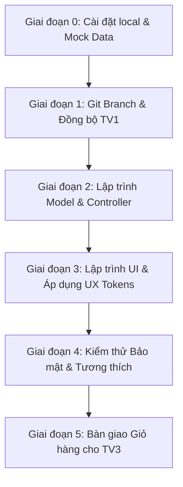

# ⚙️ Quy trình làm việc chi tiết — Thành viên 2 (User Flow & Web)

Tài liệu này hướng dẫn chi tiết quy trình thực tế từ chuẩn bị môi trường, viết mã nguồn, kiểm thử cục bộ cho đến khi bàn giao tích hợp của **Thành viên 2 (Phụ trách giao diện Người dùng và Giỏ hàng)** thuộc dự án YumGO.

---

## 🗺️ Bản đồ Quy trình Tổng quan



---

## 💻 Quy trình 1: Chuẩn bị Môi trường & Cơ sở dữ liệu (Local Setup)

Do TV4 (Admin) chưa làm xong phần CRUD món ăn, bạn bắt buộc phải tự chuẩn bị dữ liệu mẫu (Mock Data) để hiển thị giao diện.

### Bước 1.1: Thiết lập cơ sở dữ liệu
1. Mở công cụ quản lý cơ sở dữ liệu (phpMyAdmin / Laragon / DBeaver).
2. Tạo database tên là `yumgo`.
3. Import file `database/yumgo.sql` do TV1 cung cấp.

### Bước 1.2: Nạp dữ liệu giả lập (Mock SQL Script)
Chạy script SQL sau để có danh mục và món ăn chạy thử trên trang chủ và trang thực đơn:

```sql
-- 1. Thêm danh mục mẫu (categories)
INSERT INTO `categories` (`id`, `name`, `image`, `is_deleted`) VALUES
(1, 'Gà Rán', 'ga_ran.jpg', 0),
(2, 'Pizza', 'pizza.jpg', 0),
(3, 'Trà Sữa', 'tra_sua.jpg', 0),
(4, 'Mì Ý', 'mi_y.jpg', 0);

-- 2. Thêm món ăn mẫu (foods)
INSERT INTO `foods` (`id`, `category_id`, `name`, `price`, `description`, `image`, `is_hot`, `is_sale`, `discount_percent`, `is_available`, `is_deleted`) VALUES
-- Danh mục Gà Rán
(1, 1, 'Gà Rán Giòn Cay', 35000, 'Gà chiên giòn rụm vị cay nồng đặc trưng, kèm nước sốt.', 'ga_ran_gion.jpg', 1, 0, 0, 1, 0),
(2, 1, 'Gà Rán Sốt Hàn Quốc', 39000, 'Gà rán phủ sốt cay ngọt kiểu Hàn, rắc mè rang thơm phức.', 'ga_sot_han.jpg', 0, 1, 10, 1, 0),
-- Danh mục Pizza
(3, 2, 'Pizza Thập Cẩm Lớn', 120000, 'Pizza đầy đủ topping thịt nguội, xúc xích, ớt chuông và phô mai mozzarella.', 'pizza_thap_cam.jpg', 1, 1, 15, 1, 0),
(4, 2, 'Pizza Hải Sản Pesto', 135000, 'Tôm, mực tươi ngon trên nền sốt pesto xanh đặc trưng.', 'pizza_hai_san.jpg', 0, 0, 0, 0, 0), -- Trạng thái: Hết hàng
-- Danh mục Trà Sữa
(5, 3, 'Trà Sữa Trân Châu Hoàng Gia', 30000, 'Trà sữa truyền thống đậm vị trà kèm trân châu đen dai giòn.', 'tra_sua_tc.jpg', 0, 0, 0, 1, 0),
(6, 3, 'Sữa Tươi Trân Châu Đường Đen', 35000, 'Sữa tươi thanh trùng kết hợp đường đen Hàn Quốc ngọt thanh.', 'sua_tuoi_dd.jpg', 1, 0, 0, 1, 0);
```

> [!TIP]
> Đối với hình ảnh món ăn (`image`), nếu chưa có ảnh thực tế trong thư mục `/uploads/foods/`, hãy tải một vài ảnh mẫu lưu vào đó để tránh bị lỗi hiển thị ảnh trống.

---

## 🌿 Quy trình 2: Quản lý Nhánh Git & Đồng bộ

Tránh xung đột mã nguồn (Conflict) với các thành viên khác bằng cách tuân thủ quy trình Git sau:

### Bước 2.1: Lấy code mới nhất từ dev
Trước khi bắt đầu làm việc mỗi ngày:
```bash
git checkout dev
git pull origin dev
```

### Bước 2.2: Tạo nhánh tính năng riêng
```bash
git checkout -b feature/member2-user
```

### Bước 2.3: Viết commit đúng quy chuẩn
Hãy chia nhỏ các tính năng thành các commit riêng biệt để dễ quản lý:
* Thêm chức năng: `feat: add food search logic to model`
* Chỉnh sửa giao diện: `style: update food-card with design tokens`
* Sửa lỗi: `fix: validate quantity in cart controller`

### Bước 2.4: Hợp nhất (Merge) code cuối ngày
Khi hoàn thành một phần việc, bạn đẩy lên nhánh phụ của mình và tạo Pull Request (PR) vào nhánh `dev` để TV1 review và duyệt:
```bash
git add .
git commit -m "feat: implement session cart functionality"
git push origin feature/member2-user
```
> [!WARNING]
> **Tuyệt đối không** push trực tiếp lên nhánh `main` hoặc `dev` khi chưa được sự đồng ý của trưởng nhóm (TV1).

---

## 🛠️ Quy trình 3: Viết Code & Phân rã cấu trúc (Architecture Flow)

Theo đặc tả cấu trúc MVC đã chốt, bạn cần thực hiện theo các bước sau cho mỗi trang:

### Bước 3.0: Đọc vị thiết kế (Brief Inference) & Bản đồ Thư viện
1.  **Đọc vị thiết kế (Brief Inference):** Xác định YumGO là trang đặt món trực tuyến cho đối tượng khách hàng trẻ tuổi, thèm ăn nhanh. Ngôn ngữ trực quan hướng tới sự rực rỡ của ẩm thực (vibe kích thích vị giác) kết hợp hệ thống layout bento thoáng đãng.
2.  **Thiết lập tham số Dials:** Áp dụng chặt chẽ `DESIGN_VARIANCE: 7`, `MOTION_INTENSITY: 6`, và `VISUAL_DENSITY: 4` để duy trì mật độ phân cấp thông tin và micro-motion mượt mà.
3.  **Bản đồ Thư viện (Design System Map):** Nhúng và sử dụng tối đa các thư viện CDN hỗ trợ thay vì viết đè CSS thủ công:
    *   **Alpine.js:** Quản lý trạng thái đóng/mở Side-Drawer Cart và Left Sidebar Menu.
    *   **GSAP:** Tạo hiệu ứng trôi nổi (floating animation) và stagger load cho danh sách thẻ sản phẩm.
    *   **SweetAlert2:** Quản lý hộp thoại xác nhận xóa món và Toast báo thêm giỏ hàng thành công.

### Bước 3.1: Viết Model (Query dữ liệu qua PDO)
* Không viết truy vấn SQL trực tiếp trong các file View.
* Viết các hàm nghiệp vụ trong file model tương ứng (ví dụ: `/models/Food.php`).

*Ví dụ khung Model lấy món ăn:*
```php
<?php
// /models/Food.php
class Food {
    private $db;

    public function __construct($pdo) {
        $this->db = $pdo;
    }

    // Lấy chi tiết món ăn (Chỉ lấy món chưa bị xóa)
    public function getById($id) {
        $stmt = $this->db->prepare("SELECT * FROM foods WHERE id = :id AND is_deleted = 0");
        $stmt->execute(['id' => $id]);
        return $stmt->fetch(PDO::FETCH_ASSOC);
    }
}
```

### Bước 3.2: Viết Controller (Điều phối logic)
* Nhận yêu cầu từ người dùng (ví dụ: `id` món ăn, từ khóa tìm kiếm).
* Gọi Model xử lý dữ liệu.
* Gọi View thích hợp để hiển thị.

*Ví dụ Controller chi tiết món:*
```php
<?php
// /controllers/FoodController.php
require_once __DIR__ . '/../models/Food.php';

class FoodController {
    private $foodModel;

    public function __construct($pdo) {
        $this->foodModel = new Food($pdo);
    }

    public function detail($id) {
        // Validate đầu vào
        $id = filter_var($id, FILTER_VALIDATE_INT);
        if (!$id || $id <= 0) {
            header("Location: index.php?page=home");
            exit;
        }

        // Gọi model lấy dữ liệu
        $food = $this->foodModel->getById($id);

        if (!$food) {
            // Hiển thị trạng thái không tìm thấy món
            $title = "Không tìm thấy món ăn";
            require __DIR__ . '/../views/user/partials/empty-state.php';
            return;
        }

        // Truyền biến sang View
        require __DIR__ . '/../views/user/food-detail.php';
    }
}
```

### Bước 3.3: Viết View & Nhúng Giao diện (Áp dụng UI/UX Skill)
* Sử dụng biến được truyền từ Controller.
* Bắt buộc áp dụng biến CSS token trong [YUMGO_UI_UX_SKILL.md](file:///d:/CNTT23A-CS/HK3%202025-2026/Lap%20trinh%20PHP/YumGOv1/agent/YUMGO_UI_UX_SKILL.md) tại file `assets/css/user.css`.
* Dùng `htmlspecialchars()` cho mọi nội dung văn bản hiển thị từ CSDL để tránh tấn công XSS.

---

## 🔒 Quy trình 4: Kiểm thử Bảo mật & Ràng buộc Nghiệp vụ (Self-Testing)

Trước khi bàn giao, bạn phải tự kiểm tra các kịch bản sau trên local:

### 4.1. Kiểm thử Ràng buộc Database trên Giao diện
- [x] **Món hết hàng (`is_available = 0`):** Kiểm tra xem ảnh món đó có bị mờ và chuyển sang màu đen trắng (`filter: grayscale(100%)`) không. Nút thêm nhanh `(+)` phải chuyển thành nhãn tĩnh `"Tạm hết hàng"`.
- [x] **Món được gắn thẻ HOT / SALE:** Nhãn `"HOT 🔥"` và nhãn giảm giá `-15%` phải được hiển thị nổi bật, đè lên trên ảnh món ăn.
- [x] **Món bị xóa (`is_deleted = 1`):** Thử truy cập trực tiếp bằng URL (ví dụ: `index.php?page=food-detail&id=99` - với id là món đã bị xóa mềm). Hệ thống phải hiển thị màn hình Empty State chứ không được báo lỗi hệ thống hoặc hiển thị trang trống trắng.

### 4.2. Kiểm thử bảo mật & Validation dữ liệu
- [x] **Chống SQL Injection:** Nhập thử các chuỗi ký tự lạ vào ô tìm kiếm (ví dụ: `' OR '1'='1`). Hệ thống không được báo lỗi SQL và chỉ hiển thị "Không tìm thấy kết quả".
- [x] **Chống XSS:** Thử tạo một danh mục hoặc món ăn có tên chứa mã độc `<script>alert(1)</script>` trong DB. Khi trang web tải, hộp thoại alert không được phép xuất hiện (mã HTML phải được escape an toàn).
- [x] **Validate Giỏ hàng:**
  - [x] Thử sửa code HTML (Inspect Element) để gửi số lượng món ăn là số âm (`-5`) hoặc chữ (`abc`). Backend phải chặn được và báo lỗi.
  - [x] Thử thêm món ăn đã bị ẩn/hết hàng vào giỏ bằng cách gọi URL giả lập. Hệ thống phải từ chối.

### 4.3. Kiểm thử Trải nghiệm Người dùng (UX & Micro-motion Testing)
- [x] **Kiểm thử Phản hồi Xúc giác (Tactile Feedback):** Rà soát các tương tác nhấp nút (như nút cộng/trừ số lượng, nút thêm món nhanh) xem có áp dụng hiệu ứng thu phóng đàn hồi (`active:scale-[0.98]` hoặc co giãn mượt mà) để tạo phản hồi vật lý tự nhiên hay không.
- [x] **Kiểm thử Độ ổn định Khung nhìn di động:** Kiểm tra thanh CTA đặt hàng di động và Header khi cuộn xem có bị che khuất chữ, giật khung hình hay nhảy layout trên Safari di động không (kiểm tra thuộc tính `min-h-[100dvh]`).
- [x] **Kiểm thử Hiệu năng Chuyển động phần cứng:** Đảm bảo các chuyển động phức tạp (như đĩa bay, drawer trượt) sử dụng các thuộc tính tăng tốc GPU như `will-change: transform, opacity` và không làm sụt giảm tốc độ tải trang dưới 60 FPS.

---

## 🤝 Quy trình 5: Tích hợp & Bàn giao (Handover & Integration)

Đây là bước cực kỳ quan trọng để code của bạn hoạt động khớp với phần việc của **Thành viên 3 (Checkout/Order)** và **Thành viên 1 (Core/Layout)**.

### Bước 5.1: Chuẩn hóa dữ liệu giỏ hàng trong Session
Thống nhất cấu trúc lưu trữ giỏ hàng trong `$_SESSION['cart']`. **Chỉ lưu `food_id` và `quantity` (Số lượng)**, tuyệt đối không lưu giá tiền hay tên món vào session để tránh lỗ hổng bảo mật người dùng sửa giá.

```php
// Cấu trúc chuẩn của Session Cart
$_SESSION['cart'] = [
    2 => [ // id món ăn
        'food_id' => 2,
        'quantity' => 1
    ],
    5 => [
        'food_id' => 5,
        'quantity' => 3
    ]
];
```

Khi trang Giỏ hàng (`cart.php`) hiển thị, bạn thực hiện truy vấn trực tiếp vào CSDL để lấy tên, ảnh và giá tiền mới nhất của món ăn dựa theo `food_id` trong Session:
```php
// Cách tính tổng tiền an toàn trên Backend
$subtotal = 0;
foreach ($_SESSION['cart'] as $id => $item) {
    $food = $foodModel->getById($id);
    if ($food && $food['is_available']) {
        $price = $food['is_sale'] ? ($food['price'] * (1 - $food['discount_percent']/100)) : $food['price'];
        $subtotal += $price * $item['quantity'];
    }
}
```

### Bước 5.2: Bàn giao luồng chuyển hướng Checkout
Khi người dùng bấm nút **"Tiến hành đặt hàng"** tại trang giỏ hàng:
1. Bạn kiểm tra xem giỏ hàng có trống không. Nếu trống, chặn lại và thông báo.
2. Nếu giỏ hàng hợp lệ, chuyển hướng người dùng sang trang checkout của **Thành viên 3**:
   `header("Location: index.php?page=checkout");`
3. Cung cấp tài liệu định dạng `$_SESSION['cart']` này cho TV3 để họ đọc dữ liệu và tiến hành lưu hóa đơn vào bảng `orders` và `order_items`.
